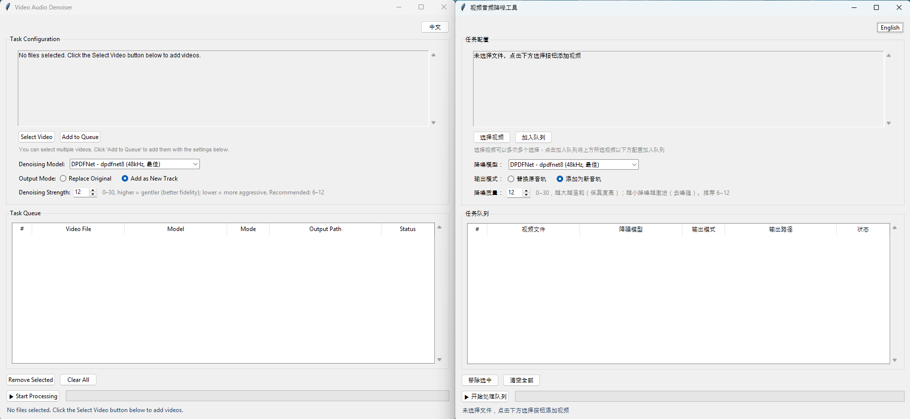

# Video Audio Denoiser / 视频音频降噪工具

A deep-learning-based video audio denoising tool supporting two model families:
基于深度学习的视频音轨降噪工具，支持两种模型：

- **ZipEnhancer** (Alibaba Tongyi Lab / 阿里通义实验室) — 16kHz single-mic speech denoising, ModelScope pipeline
- **DPDFNet** (CEVA) — multi-sample-rate speech enhancement, 6 variants available (baseline / dpdfnet2 / dpdfnet4 / dpdfnet8 / 48kHz series)



---

## Installation / 安装

### 0. Clone the repository / 克隆仓库

```bash
git clone git@github.com:ErwinLiYH/denoise_gui.git
cd denoise_gui
```

### 1. Install ffmpeg / 安装 ffmpeg

This tool requires system ffmpeg for video audio extraction and muxing.
本工具依赖系统 ffmpeg 进行视频音频提取与合成。

- **Windows**: Download [ffmpeg](https://ffmpeg.org/download.html), extract and add the `bin` directory to PATH
- **macOS**: `brew install ffmpeg`
- **Ubuntu/Debian**: `sudo apt install ffmpeg`
- Verify installation / 检查是否安装成功: `ffmpeg -version`

### 2. Install Python dependencies / 安装 Python 依赖

Choose the appropriate requirements file based on your hardware:
根据你的硬件选择合适的 requirements 文件：

#### CPU-only (no NVIDIA GPU) / 纯 CPU（无 NVIDIA 显卡）

```bash
cd video_denoiser
pip install -r requirements.cpu.txt
```

#### NVIDIA GPU (CUDA 12.9) / NVIDIA GPU（CUDA 12.9）

```bash
cd video_denoiser
pip install -r requirements.nv_gpu.txt
```

> **Note / 说明**: The GPU version uses `onnxruntime-gpu` and PyTorch with CUDA 12.9 support (`+cu129`). The CPU version uses standard `onnxruntime` and CPU-only PyTorch. Both versions share the same codebase — only the backend libraries differ.
> GPU 版本使用 `onnxruntime-gpu` 和带 CUDA 12.9 支持的 PyTorch（`+cu129`）。CPU 版本使用标准 `onnxruntime` 和纯 CPU 版 PyTorch。两个版本共用同一套代码，仅底层库不同。

> **Linux users / Linux 用户**: If soundfile reports an error, install libsndfile:
> ```bash
> sudo apt install libsndfile1
> ```

---

## Usage / 使用

```bash
python main.py
```

On first use, model weights are downloaded automatically. ZipEnhancer is ~19 MB; DPDFNet is ~8–18 MB depending on the variant.
首次使用会自动下载模型权重，ZipEnhancer 约 19MB，DPDFNet 按所选模型约 8-18MB。

---

## Models / 模型列表

| Model Key (内部 key) | Display Name (显示名) | Sample Rate (采样率) | Note (备注) |
|---|---|---|---|
| `zipenhancer` | ZipEnhancer (16kHz) | 16 kHz | Fast, single-mic speech / 快速单麦语音 |
| `dpdfnet_baseline` | DPDFNet - baseline (16kHz, 最快) | 16 kHz | Fastest DPDFNet / 最快 |
| `dpdfnet2` | DPDFNet - dpdfnet2 (16kHz, 实时) | 16 kHz | Real-time / 实时 |
| `dpdfnet4` | DPDFNet - dpdfnet4 (16kHz, 均衡) | 16 kHz | Balanced / 均衡 |
| `dpdfnet8` | DPDFNet - dpdfnet8 (16kHz, 最佳) | 16 kHz | Best quality @ 16kHz / 16kHz 最佳 |
| `dpdfnet2_48khz_hr` | DPDFNet - dpdfnet2 (48kHz, 均衡) | 48 kHz | Balanced @ high-res / 高采样均衡 |
| `dpdfnet8_48khz_hr` | DPDFNet - dpdfnet8 (48kHz, 最佳) | 48 kHz | Best quality overall / 整体最佳 |

---

## Output Modes / 输出模式

- **Replace (替换原音轨)**: Replaces the original audio track with the denoised one / 用降噪音频替换原音轨
- **Add (添加为新音轨)**: Adds the denoised audio as a new track, keeping the original / 将降噪音频追加为新音轨，保留原始音轨

---

## Denoising Strength / 降噪强度

For DPDFNet models, you can adjust the denoising strength (0–30 dB, default 12):
DPDFNet 模型可调节降噪强度（0–30 dB，默认 12）：

- **Higher values (higher dB / 更高值)**: More conservative, better fidelity / 越温和，保真度越高
- **Lower values (lower dB / 更低值)**: More aggressive denoising / 降噪越激进
- **Recommended / 推荐**: 6–12 dB

ZipEnhancer does not support this parameter.
ZipEnhancer 不支持此参数。

---

## Supported Formats / 支持格式

Input / 输入: `.mp4`, `.mkv`, `.mov`, `.avi`, `.webm`, `.flv`, `.wmv`
Output / 输出: same as input format / 与输入格式相同

---

## References / 参考链接

### ZipEnhancer

- Model / 模型: [iic/speech_zipenhancer_ans_multiloss_16k_base](https://modelscope.cn/models/iic/speech_zipenhancer_ans_multiloss_16k_base)
- Paper / 论文: [ZipEnhancer: A Strong Dual-Path Speech Enhancement Model with Separate Training and Inference](https://arxiv.org/abs/2501.05183)

### DPDFNet

- GitHub / 代码仓库: [ceva-ip/DPDFNet](https://github.com/ceva-ip/DPDFNet)
- Paper / 论文: [DPDFNet: A Dual-Path Deep Filtering Network with Learnable Switching for Speech Enhancement](https://arxiv.org/abs/2512.16420)
